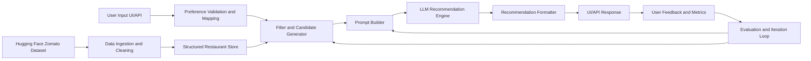

# Problem Statement: AI-Powered Restaurant Recommendation System

## Background
Users often struggle to choose restaurants that match their exact needs. Traditional filtering helps narrow options, but it does not always provide clear, personalized reasoning.  
This project aims to build a recommendation system inspired by Zomato that combines structured restaurant data with a Large Language Model (LLM) to deliver relevant and explainable suggestions.

## Objective
Design and implement an application that:
- Accepts user preferences (location, budget, cuisine, rating, etc.).
- Uses a real-world restaurant dataset.
- Generates personalized recommendations using an LLM.
- Presents clear, useful, and human-readable results.

## Scope and Workflow

### 1) Data Ingestion and Preparation
- Load the Zomato dataset from Hugging Face:  
  [https://huggingface.co/datasets/ManikaSaini/zomato-restaurant-recommendation](https://huggingface.co/datasets/ManikaSaini/zomato-restaurant-recommendation)
- Clean and preprocess relevant fields.
- Extract key attributes such as:
  - Restaurant name
  - Location
  - Cuisine
  - Average/estimated cost
  - Rating
  - Any additional metadata useful for ranking

### 2) User Preference Collection
Capture user inputs, including:
- **Location** (e.g., Delhi, Bangalore)
- **Budget range** (low, medium, high)
- **Preferred cuisine** (e.g., Italian, Chinese)
- **Minimum acceptable rating**
- **Optional preferences** (e.g., family-friendly, quick service, ambience)

### 3) Retrieval and Prompt Construction
- Filter restaurants based on user constraints.
- Prepare the filtered records in a structured format.
- Build a prompt that enables the LLM to:
  - Compare candidates
  - Rank restaurants by suitability
  - Explain recommendation choices

### 4) Recommendation Generation
Use the LLM to produce:
- Ranked restaurant recommendations
- Brief justification for each recommendation
- Optional summary for quick decision-making

### 5) Result Presentation
Display top recommendations in a user-friendly output format with:
- Restaurant name
- Cuisine type
- Rating
- Estimated cost
- AI-generated explanation of why it matches user preferences

## Expected Outcome
The final system should provide accurate, explainable, and personalized restaurant recommendations that are more useful than basic filtering alone.

## Phase-Wise Architecture

### Architecture Overview
The system is designed in progressive phases so each stage is independently buildable and testable.  
Each phase adds one major capability while preserving modularity and clear interfaces between components.

### Phase 1: Data Foundation Layer
**Goal:** Build a reliable restaurant data pipeline.

**Components**
- Dataset loader (Hugging Face ingestion)
- Data cleaning and normalization module
- Feature extraction module
- Storage layer (CSV/JSON/SQLite/PostgreSQL)

**Inputs**
- Raw Zomato dataset

**Outputs**
- Cleaned, structured restaurant records ready for filtering

**Success Criteria**
- Data quality checks pass (null handling, type consistency, schema validation)
- Core restaurant attributes are available for all retrievable records

### Phase 2: Preference Capture Layer
**Goal:** Capture user intent in a structured form.

**Components**
- User input API/UI form
- Input validation service
- Preference schema mapper

**Inputs**
- User constraints (location, budget, cuisine, min rating, optional preferences)

**Outputs**
- Standardized preference object used by retrieval and ranking

**Success Criteria**
- Invalid or ambiguous inputs are handled gracefully
- Preferences are consistently transformed into machine-usable filters

### Phase 3: Retrieval and Candidate Generation Layer
**Goal:** Narrow the search space to high-quality candidate restaurants.

**Components**
- Rule-based filter engine (hard constraints)
- Candidate scoring preprocessor (optional soft scoring)
- Context builder for LLM prompt

**Inputs**
- Clean restaurant dataset
- Standardized user preference object

**Outputs**
- Top-N candidate restaurants with structured metadata

**Success Criteria**
- Candidate list respects strict constraints
- Candidate quality is high enough for LLM reasoning

### Phase 4: LLM Recommendation and Reasoning Layer
**Goal:** Generate ranked and explainable recommendations.

**Components**
- Prompt template engine
- LLM orchestration module
- Output parser and formatter
- Safety/guardrail checks (format, hallucination minimization via grounded input)

**Inputs**
- Candidate restaurant set
- Prompt instructions + preference context

**Outputs**
- Ranked recommendations with natural-language explanations

**Success Criteria**
- Responses are grounded in provided candidate data
- Explanations align with user preferences and ranking logic

### Phase 5: Response Delivery and Experience Layer
**Goal:** Present recommendations clearly to end users.

**Components**
- Result API endpoint
- Presentation layer (CLI/Web UI)
- Response cards (name, cuisine, rating, cost, explanation)

**Inputs**
- Structured LLM recommendations

**Outputs**
- User-friendly recommendation view

**Success Criteria**
- Fast response time and readable output
- Users can compare options quickly

### Phase 6: Monitoring, Evaluation, and Improvement Layer
**Goal:** Continuously improve recommendation quality and reliability.

**Components**
- Logging and observability
- Feedback capture (optional thumbs up/down)
- Evaluation pipeline (precision@k, relevance, latency, consistency)
- Prompt and ranking iteration loop

**Inputs**
- Runtime metrics, user interactions, recommendation outputs

**Outputs**
- Actionable insights for improving prompts, filtering, and ranking logic

**Success Criteria**
- Quality metrics improve over iterations
- Failure cases are identified and reduced over time

### End-to-End Component Flow

### Suggested Deliverables by Phase
- **Phase 1:** Clean dataset pipeline + schema documentation
- **Phase 2:** Preference input contract + validation rules
- **Phase 3:** Candidate retrieval service + baseline ranking
- **Phase 4:** Prompt templates + LLM output parser
- **Phase 5:** User-facing recommendation interface
- **Phase 6:** Evaluation dashboard + improvement backlog
